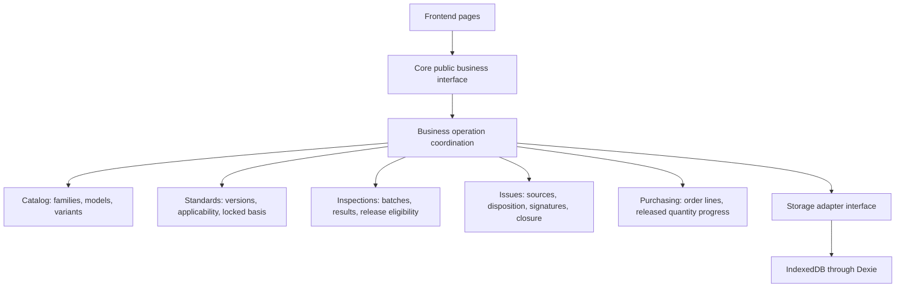

# Core Business Design

Status: 2026-09-28. The first local edition implements the module decomposition below. Exact interfaces are defined in [Local App Contract](app-contract.md), and actual verification is recorded in [Local App Acceptance](app-acceptance.md). Confirmed business rules remain in [Requirements and Decisions](requirements.md); terminology is defined in [the domain glossary](../CONTEXT.md).

## Batch Workspace Prototype Direction

- Use the original PDF inspection table as the layout reference for the main workspace. On 2026-09-27, the AP OQC pages in the S11-S14 and S15 reference PDFs were visually inspected for the requested prototype; see [Prototype Scope and Review](prototype.md) for source references and the review boundary.
- Keep the table editable for batch inspection results, with each inspection record owning its photo references. A photo column may exist, but its cells must belong to individual inspection rows rather than a merged, shared photo area.
- Use the Lark edition as a reference for per-record photo association. This is a confirmed user requirement, not a claim that the live Lark configuration was inspected during this update.
- Proposed photo interaction: show each row's thumbnails and an add-photo action, and open that row's photos for larger viewing. Selecting or adding evidence for one row must not change another row's photo references.
- Include prototype acceptance checks for separate photo collections on two inspection rows and on the same inspection item in two different batches. Retain green as the important-check marker, not a pass/fail color.

## Module Responsibilities

Keep one public business interface for frontend callers. Internally, organize rules into cohesive modules rather than putting all behavior into one file. These are modules within the existing application, not separately deployed services.



| Module | Responsibility | Important invariant |
| --- | --- | --- |
| Catalog | Identify inspection families, product models, and variants | Shared inspection requirements do not merge distinct purchase variants |
| Standards | Resolve versions and factory/stage items; define the inspection basis locked at batch creation | Later source changes do not silently alter existing batch requirements |
| Inspections | Record batch results and evidence links; evaluate batch release eligibility | A released result requires an explicit action and satisfied conditions |
| Issues | Link sources, prevent duplicate issue creation, retain discussion and formal disposition separately, and check closure requirements | Three confirmations do not automatically close an issue; open linked issues block batch release |
| Purchasing | Represent ordered variants and quantities; compute progress from attributable released quantities | Unreleased quantities contribute zero; one variant's surplus cannot cover another's shortage |

The operation coordinator loads relevant data through the adapter, invokes rules, and commits related changes together. Rule calculations do not depend on the DOM or Dexie. Storage owns reads, writes, indexes, migrations, attachments, and transaction mechanics; it does not independently decide whether a batch may be released.

## Original Interface Sketch

The table below preserves the original design vocabulary. The implemented entry points are `createQCService`, its query methods, and `command(type, data, expectedRevision)`; see [Local App Contract](app-contract.md) for exact command names and payloads.

| Operation | Intended result |
| --- | --- |
| `createPurchaseOrder(...)` | Save an order and its variant-specific quantity requirements |
| `createBatch(...)` | Validate context, resolve one shared version label for every selected product family, and persist each product's locked inspection basis with the batch |
| `getBatchWorkspace(...)` | Return the locked requirements, current results, evidence references, and issue summary needed by the page |
| `saveInspection(...)` | Validate and save defects, entered numeric time, and remarks for a specific batch item |
| `autosaveInspection(...)` | Persist valid partial or complete row results, including cleared nullable fields; complete rows alone qualify for issue snapshots, comparisons, and release |
| `deleteBatch(...)` | Delete a draft operational batch after dependency checks while preserving shared documents and independent records |
| `createIssueFromInspection(...)` | Create or return the existing issue for the agreed source identity |
| `closeIssue(...)` | Check owner, formal disposition, and three confirmations before recording manual closure |
| `releaseBatch(...)` | Validate current batch state, linked issues, release scope, and other agreed conditions before recording release |
| `getPurchaseOrderProgress(...)` | Calculate ordered, released, outstanding, and excess quantities per order line |

Each operation needs documented input, output, validation failures, missing-reference behavior, retry semantics, and atomic write scope before implementation. Use stable IDs for relationships, not display text. Async interfaces allow storage operations to remain independent of frontend rendering.

## Release and Purchase Progress

```mermaid
sequenceDiagram
    participant UI as Frontend
    participant Core as Core business operation
    participant Store as Storage adapter
    UI->>Core: Request batch release
    Core->>Store: Read current batch, issues, and related quantity references
    Store-->>Core: Current facts
    Core->>Core: Validate release conditions and agreed quantity scope
    alt Invalid or changed state
        Core-->>UI: Explain unmet conditions; do not record release
    else Valid state
        Core->>Store: Atomically validate current state and commit release facts
        Store-->>Core: Commit succeeded
        Core-->>UI: Release saved
        UI->>Core: Request purchase order progress
        Core->>Store: Read attributable release facts
        Store-->>Core: Committed facts
        Core->>Core: Aggregate each eligible quantity once per order line
        Core-->>UI: Ordered, released, outstanding, and excess quantities
    end
```

The local edition derives purchase progress from stored release and quantity-association facts, rather than incrementing an independent total whenever a button is clicked. Repeated release requests must not count the same quantity again. A progress-query failure after a successful release does not undo that release; the UI can retry the query and should distinguish these outcomes.

For each order line, released quantity is the sum of eligible, uniquely attributed released product quantities. Outstanding quantity is `max(ordered - released, 0)`; excess quantity is `max(released - ordered, 0)`. A new batch may contain several colors of one model from one PO; full-batch release attributes each product's quantity to its own order line. Do not sum inspection records or inspection sample sizes as fulfilled units.

When state used by a decision can change, validation and writes must operate on a consistent state. The adapter must support transactional reads/writes or an equivalent current-state check so a newly opened issue cannot be missed between validation and release.

## Implementation Slices and Acceptance

Build each slice through frontend, core, and storage, with observable behavior before expanding. Concrete code implementation is delegated to Luna Max; the primary agent owns interface design, integration, review, and acceptance.

1. **Catalog and standards:** distinguish the two inspection families, models, and variants; resolve applicable factory/stage items for a version. Verify that variants share the intended requirements without losing their identities.
2. **Create and inspect a batch:** lock the inspection basis, save one item's result, and reload it after refresh. Verify that subsequent source-standard changes do not alter that batch and that results in separate batches remain separate.
3. **Issue and release workflow:** connect source inspection, disposition, confirmations, manual closure, and manual release. Verify duplicate issue protection, unmet closure conditions, open-issue release blocking, and retry-safe release persistence.
4. **Purchase quantity tracking:** enter variant-specific order lines, associate batch quantities, and compute released progress across batches. Verify zero contribution before release, one contribution after release, variant separation, outstanding/excess quantities, and automatic exclusion of IQC from PO fulfillment.
5. **Operational completion:** verify attachments, historical comparison, reports, backups, and database upgrades as those features are implemented. Keep using development data until backup/restore is available and verified; mark untested platforms explicitly.

## First-Edition Decisions and Remaining Boundaries

Versions belong to inspection families and use numeric sequences. Published versions are immutable; batches copy applicable model/factory/stage rows and reject empty or ambiguous applicability. A new batch selects one label common to every selected product and resolves it to the family-specific version entity for each product. Product quantities and inspection rows remain separate, and a batch releases their full quantities together. Every row must be saved, a recorder must be entered, and all linked issues must be closed before release.

New OQC batches automatically contribute to PO fulfillment after release; IQC does not. There is no physical-lot entry, final-shipment choice, or batch reinspection workflow. Saved legacy flags remain intact for compatibility. Partial release, release correction, and shared multi-computer storage remain later design work. See [Requirements and Decisions](requirements.md) for which choices the user confirmed and which are initial implementation conventions.
